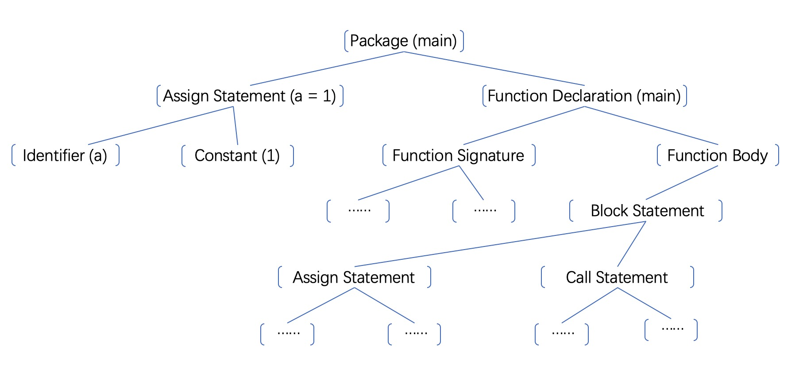

# Goscript 设计原理: 总览

## 简介

Goscript是一个用Rust写的,基于虚拟机的Go语言标准实现。Goscript设计原理系列文章的目标是说明其工作机制。目标读者是任何有兴趣了解Goscipt如何工作的人，或者更宽泛地说，任何对编译器，脚本语言，或者Go语言可以如何实现有兴趣的人。具备编译器/Rust/Go相关的背景知识肯定会有助于理解，但不是必须的。同时，对于专家来说，很可能就不值一看了。

开始之前，我们给各个子项目列个表：
Before we dive in, let's make a table of all the sub-projects:
| 项目 |            简介 | 编程语言 | 创作方 |
| ----------- |         ----------- | ------ |  ------ |
| Parser | 解析器，从源代码到AST | Rust | 移植自官方Go版本 |
| Type Checker | 类型推导及其他  | Rust | 移植自官方Go版本 |
| Codegen | 从AST到字节码 | Rust | 原创
| VM | 虚拟机，运行字节码 | Rust | 原创
| Engine | 封装和标准库的native部分 | Rust | 原创
| Std | 标准库 | Go | 移植自官方 |

我们先用一个简单的例子来展示，Goscript运行代码时发生了什么：

```go
package main

var a = 1

func main() {
    b := 2
    c := a + b
    assert(c == 3) // 内置函数
}
```

### 解析器

解析器读取源代码然后把它变成一颗抽象语法树即AST ([Abstract Syntax Tree](https://en.wikipedia.org/wiki/Abstract_syntax_tree))

- 手写的分词器 ([scanner.rs](https://github.com/oxfeeefeee/goscript/blob/master/parser/src/scanner.rs)) 把源代码变成一个token流，像这样:

    ```text
    package, main, var, a, EQL, 1, ...
    ```

- 手写的 [递归下降](https://en.wikipedia.org/wiki/Recursive_descent_parser) 解析器 ([parser.rs](https://github.com/oxfeeefeee/goscript/blob/master/parser/src/parser.rs)) 将token流变成语法树. 这一步可能看起来有点黑魔法，但是实际上非常直白：它就是这样一个递归程序：通过匹配当前遇到的token和预期的token，来递归的生成各种代表语句或者表达式的节点。AST的定义在这里 ([ast.rs](https://github.com/oxfeeefeee/goscript/blob/master/parser/src/ast.rs)). 上面小程序的AST大概长这样:
    

### 类型检查器

类型检查器的首要作用就是类型推导，就是说推算出每个变量，结构体，函数等的具体类型。这些类型信息会用作代码生成和语法错误的检查。具体原理是：遍历AST并根据语言标准定义的规则确定类型信息，同时检查类型不合法的情况。主要代码见 [expr.rs](https://github.com/oxfeeefeee/goscript/blob/master/types/src/check/expr.rs) 和 [stmt.rs](https://github.com/oxfeeefeee/goscript/blob/master/types/src/check/stmt.rs)。

具体到我们的例子，它会推导出来 `a`, `b`, `a + b` 和 `c` 的类型都是 `int`； `c == 3` 的类型是 `bool`。同时它也会检查 `assert` 的确是接受并且仅接受一个  `bool` 类型的参数。

类型检查是整个项目最复杂的一部分，有一个Go [官方文档](https://go.googlesource.com/example/+/HEAD/gotypes/go-types.md) 可供参考。 除了类型推导，它还会做 [ID 解析](https://github.com/oxfeeefeee/goscript/blob/master/types/src/check/resolver.rs), [常量计算](https://github.com/oxfeeefeee/goscript/blob/master/types/src/constant.rs), 和 [初始化顺序计算](https://github.com/oxfeeefeee/goscript/blob/master/types/src/check/initorder.rs).

类型检查的输出结果是一个没有任何语法错误的AST，和AST的类型信息库，这些会被用于代码生成。

### 代码生成器

代码生成器通过再次遍历AST生成运行时对象，其中包含字节码。上面例子相应生产的代码大概如下:

```text
- Package Object (main)
    - Package member variable (a)
    - Package member function (constructor)
        - bytecode: 
            // copy constant10 to register0, which is where "a" is
            DUPLICATE   |0  |-10 
            RETURN          
    - Package member variable (main)
        - bytecode:
            // copy constant7 to register0, which is where "b" is
            DUPLICATE       |0  |-7 
            // load from package8's 0th member, which is "a", to register2 
            LOAD_PKG        |2  |-8 |0
            // register1 = register2 + register0
            ADD             |1  |2  |0
            // register2 = (register1 == constant9)
            EQL             |2  |1  |-9
            // crash if register2 != true
            ASSERT          |...|2  
            RETURN          
```

Goscript最初使用的是基于栈的虚拟机，现在已经改为基于寄存器的。栈虚拟机相对直观，更容易实现，但是寄存器虚拟机性能会更好。比如说上面那个`ADD`，在用栈虚拟机的时候还需要两个"PUSH"和一个"POP"一起才能完成。

本质上来说，代码生成器是一个翻译器，它把一颗树翻译为一个一维数组。这样虚拟机自己就不用去遍历树了，虽然那样也可以做到。虚拟机现在只需要在一个虚拟的纸带上一个接一个处理指令，或者按照指令的要求跳转即可。代码生成的主要代码：[codegen.rs](https://github.com/oxfeeefeee/goscript/blob/master/codegen/src/codegen.rs).

### 虚拟机

如上所述，虚拟机就是一个巨大的循环([vm.rs](https://github.com/oxfeeefeee/goscript/blob/master/vm/src/vm.rs))，它一个接一个处理指令知道结束，所有的指令大概可以分为三类。

```text
- 普通指令:
    ADD, SUB, EQL, LOAD_ARRAY ...
- 跳转指令:
    JUMP, JUMP_IF ...
- 函数间跳转指令:
    CALL, RETURN
```

我们再来看一个稍微复杂的例子:

```go
package main

func main() {
 assert(addN(42,69) == mul(42, 69))
}

func addN(m, n int) int {
 total := 0
 for i :=0; i < n; i++ {
  total += m
 }
 return total
}

func mul(m, n int) int {
 return m * n
}
```

下面是生成的代码，增加了标号以方便下文引用：

```text
main:
1    DUPLICATE       |1 |-9 |... |... |...,
2    DUPLICATE       |2 |-10 |... |... |...,
3    LOAD_PKG        |3 |-11 |1 |... |...,
4    CALL            |3 |0 |... |FlagA |...,
5    DUPLICATE       |5 |-12 |... |... |...,
6    DUPLICATE       |6 |-13 |... |... |...,
7    LOAD_PKG        |7 |-14 |2 |... |...,
8    CALL            |7 |4 |... |FlagA |...,
9    EQL             |8 |0 |4 |Int |Int,
10   ASSERT          |... |8 |... |... |...,
11   RETURN          |... |... |... |FlagA |...,

addN:
12   DUPLICATE       |3 |-7 |... |... |...,
13   DUPLICATE       |4 |-8 |... |... |...,
14   LSS             |5 |4 |2 |Int |...,
15   JUMP_IF_NOT     |3 |5 |... |... |...,
16   ADD_ASSIGN      |3 |1 |... |Int |...,
17   INC             |4 |... |... |Int |...,
18   JUMP            |-5 |... |... |... |...,
19   DUPLICATE       |0 |3 |... |... |...,
20   RETURN          |... |... |... |FlagA |...,

mul:
21   MUL             |0 |1 |2 |Int |...,
22   RETURN          |... |... |... |FlagA |...,
```

这是在虚拟机中的执行过程:

```text
1: 拷贝 42 到 register1 作为 addN 的 参数
2: 拷贝 69 到 register2 作为 addN 的 参数
3: 读取函数 "addN" 到 register3
4: 调用 "addN", 跳转到 "addN" 的第一个指令
12: 初始化 "total" 为 0
13: 初始化 "i" 为 0
14: 比较 register4("i") 和 register2("n") 看是否 i < n, 把结果放到 register5
15: 如果 register5 不是 TRUE, 跳转到 19
16: total += m
17: i++
18: 跳转回 14
14: ...
... ...
14: ...
15: 跳转到 19
19: 拷贝 register3("total") 到 register0(返回值)
20: 返回, 跳转回 "main"
5: 拷贝 42 到 register1 作为 mul 的 参数
6: 拷贝 69 到 register2 作为 mul 的 参数
7: 读取函数 "mul" 到 register7
8: 调用 "mul", 跳转到 "mul" 的第一个指令
22: register0(return value) = register1(argument1) * register2(argument2)
23: 返回, 跳转回 "main"
9:  比较 register0 和 register4 是否相等, 把结果放到 register8
10: 如果 register8 != true 就 crash
11: 返回, 跳转出main函数，结束执行
```

### 后续内容

目前为止，几乎没有讨论Goscript独有的机制，在Python, Lua 甚至 Java 里，大致的过程也是差不多的。当然有一些小的区别：Python 和 Lua 没有类型检查，而Java的虚拟机则要复杂很多。

下一篇文章讲深入Goscript虚拟机内部，解释Go的各种特性是如何在一个相对简单的虚拟机里实现的，而这可能是一个相对有些新意的轮子。
